# 2022 Year In Books (54 Total)

## **January**
 

<a href="https://www.barnesandnoble.com/w/sophies-choice-william-styron/1100407919?ean=9780679736370" target="_blank">
    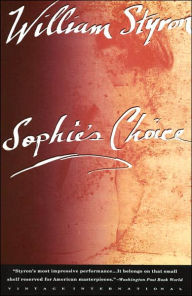
</a>

 

<a href="https://www.barnesandnoble.com/w/crying-in-h-mart-michelle-zauner/1137397295?ean=9780525657743" target="_blank">
    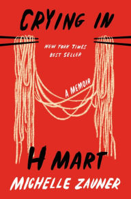
</a>

 

<a href="https://www.barnesandnoble.com/w/pride-and-prejudice-jane-austen/1002057084?ean=9780141439518" target="_blank">
    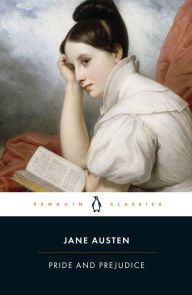
</a>

 

## **February**
 

<a href="https://www.barnesandnoble.com/w/untamed-glennon-doyle/1134074545?ean=9781984801258" target="_blank">
    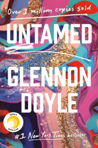
</a>

 

<a href="https://www.barnesandnoble.com/w/how-to-break-up-with-your-phone-catherine-price/1126396649?ean=9780399581120" target="_blank">
    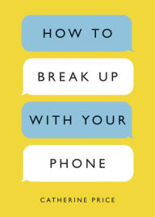
</a>

 

<a href="https://www.barnesandnoble.com/w/the-rebel-albert-camus/1111322263?ean=9780679733843" target="_blank">
    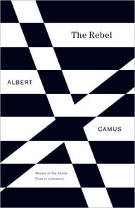
</a>

 

 

## **March**
 

<a href="https://www.barnesandnoble.com/w/people-we-meet-on-vacation-emily-henry/1137492137?ean=9781984806758" target="_blank">
    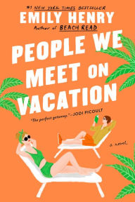
</a>

 

<a href="https://www.barnesandnoble.com/w/the-undocumented-americans-karla-cornejo-villavicencio/1135275236?ean=9780399592706" target="_blank">
    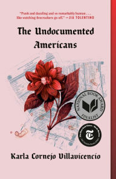
</a>

 

<a href="https://www.barnesandnoble.com/w/lesson-before-dying-ernest-j-gaines/1100082295?ean=9780375702709" target="_blank">
    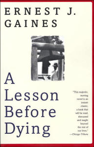
</a>

 

<a href="https://www.barnesandnoble.com/w/anatomy-of-story-john-truby/1100196082?ean=9780865479937" target="_blank">
    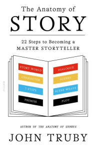
</a>

 

## **April**
 

<a href="https://www.barnesandnoble.com/w/if-beale-street-could-talk-james-a-baldwin/1103270125?ean=9780307275936" target="_blank">
    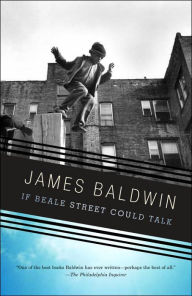
</a>

 

[The Trusted Advisor by David H. Maister]()

 

[Never Let Me Go by Kazuo Ishiguro]()

 

[Blue Like Jazz: Nonreligious Thoughts on Christian Spirituality by Donald Miller]()

 

## **May**
 

[Little Women by Louisa May Alcott]()

 

[Why Do So Many Incompetent Men Become Leaders? by Tomas Chamorro-Premuzic]()

 

[Digital Gold: Bitcoin and the Inside Story of the Misfits and Millionaires Trying to Reinvent Money by Nathaniel Popper]()

 

[Algorithms of Oppression: How Search Engines Reinforce Racism by Safiya Umoja Noble]()

 

[White Fragility: Why It's So Hard for White People to Talk About Racism by Robin DiAngelo]()

 

[Loving Sports When They Don't Love You Back: Dilemmas of the Modern Fan by Jessica Luther]()

 

## **June**
 

[Death By Black Hole by Neil deGrasse Tyson]()

 

[Open Veins of Latin America: Five Centuries of the Pillage of a Continent by Eduardo Galeano]()

 

[Atomic Habits: An Easy & Proven Way to Build Good Habits & Break Bad Ones by James Clear]()

 

[Better Small Talk by Patrick King]()

 

## **July**
 

[1776 by David McCullough]()

 

[Peter and Wendy and Peter Pan in Kensington Gardens by J.M. Barrie]()

 

[The Prophet by Kahlil Gibran]()

 

[Heart of Darkness by Joseph Conrad]()

 

[The Call of the Wild, White Fang, and Other Stories by Jack London]()

 

## **August**
 

[The Power of TED* The Empowerment Dynamic by David Emerald]()

 

[Listen Like You Mean It: Reclaiming the Lost Art of True Connection by Ximena Vengoechea]()

 

[Frankenstein: The 1818 Text by Mary Wollstonecraft Shelley]()

 

[Daring Greatly: How the Courage to Be Vulnerable Transforms the Way We Live, Love, Parent, and Lead by Brené Brown]()

 

[Mere Christianity by C.S. Lewis]()

 

[Me Talk Pretty One Day by David Sedaris]()

 

## **September**
 

[Dracula by Bram Stoker]()

 

[The Subtle Art of Not Giving a F*ck: A Counterintuitive Approach to Living a Good Life by Mark Manson]()

 

[When Breath Becomes Air by Paul Kalanithi]()

 

[Blink: The Power of Thinking Without Thinking by Malcolm Gladwell]()

 

[The Grid: The Fraying Wires Between Americans and Our Energy Future by Gretchen Bakke]()

 

[The Gifts of Imperfection by Brené Brown]()

 

## **October**
 

[Ikigai: The Japanese Secret to a Long and Happy Life by Hector Garcia Puigcerver]()

 

[User Friendly: How the Hidden Rules of Design Are Changing the Way We Live, Work, and Play by Cliff Kuang]()

 

[Macbeth by William Shakespeare]()

 

[The Alchemist by Paulo Coelho]()

 

## **November**
 

[Hamlet by William Shakespeare]()

 

[The Fall of the House of Usher and Other Writings by Edgar Allan Poe]()

 

[Everything, Beautiful: A Guide to Finding Hidden Beauty in the World by Ella Frances Sanders]()

 

[Why Has Nobody Told Me This Before by Julie Smith]()

 

## **December**
 

[When Women Lead: What They Achieve, Why They Succeed, and How We Can Learn From Them by Julia Boorstin]()

 

[Tomorrow, and Tomorrow, and Tomorrow by Gabrielle Zevin]()

 

[Braving the Wilderness: The Quest for True Belonging and the Courage to Stand Alone by Brené Brown]()

 

[Rising Strong: The Reckoning. The Rumble. The Revolution. by Brené Brown]()